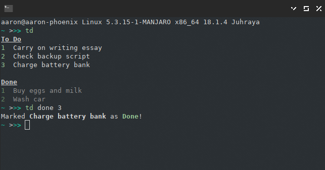

# td
td (for "today") is a minimal to do list which integrates with Trello. Select a
list and a "done" label from your Trello board, then interact with that list
from your command line.



## Installation

To invoke td, create a script somewhere in your PATH which runs the Ruby
interpreter on `src/td.rb`, passing any arguments. I use:

```bash
#!/bin/bash
ruby <path to td>/src/td.rb $@
```

You'll also need to create a configuration file in `~/.config/td` with the
following format:

```json
{
  "key": "<your Trello key>",
  "token": "<your Trello token>",
  "todayList": "<the ID of the list you want to use>",
  "doneLabel": "<the ID of the label representing items which are done>" 
}
```

You can get the key or token [here](https://trello.com/app-key/), and the list
and label IDs by poking the Trello API. I'll add an easier way to do this setup
in future!

## Usage

- `td` prints an overview of your list.
- `td done n` and `td not n` mark item number `n` as done or not done 
  respectively, by adding or removing your "done" label.
- `td count` prints a summary of how many tasks you have and how many are done,
  perfect for putting in a widget or for when you launch your shell.